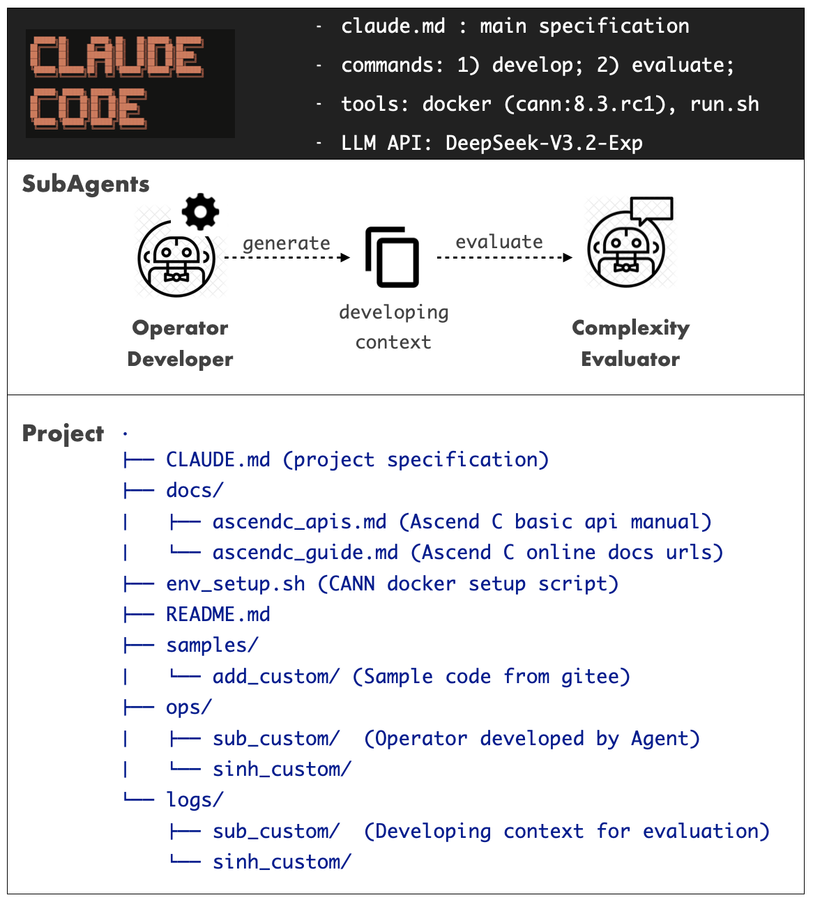
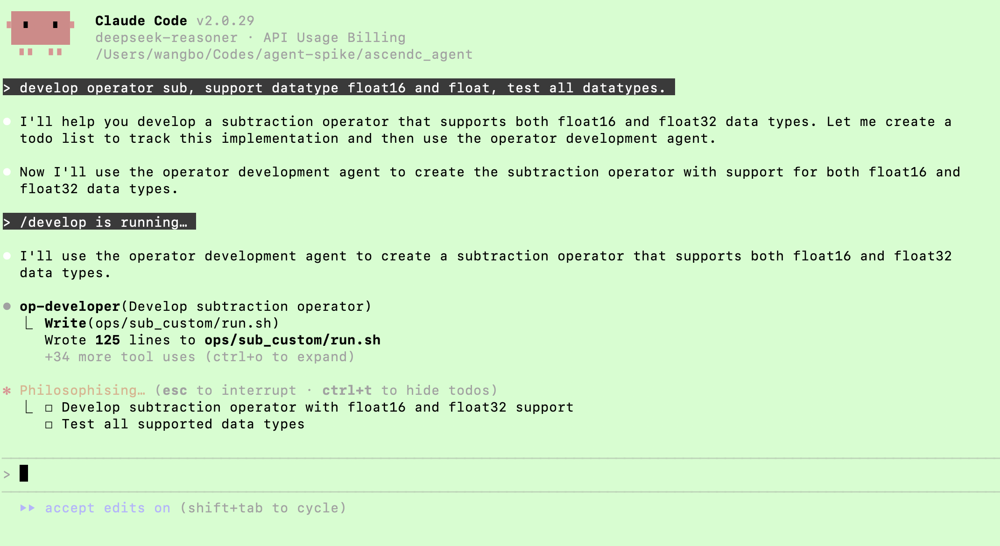
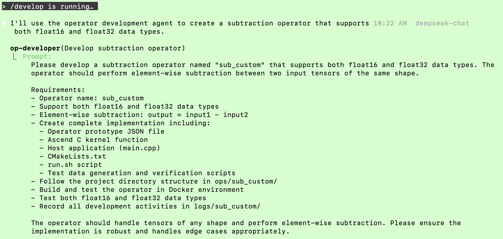
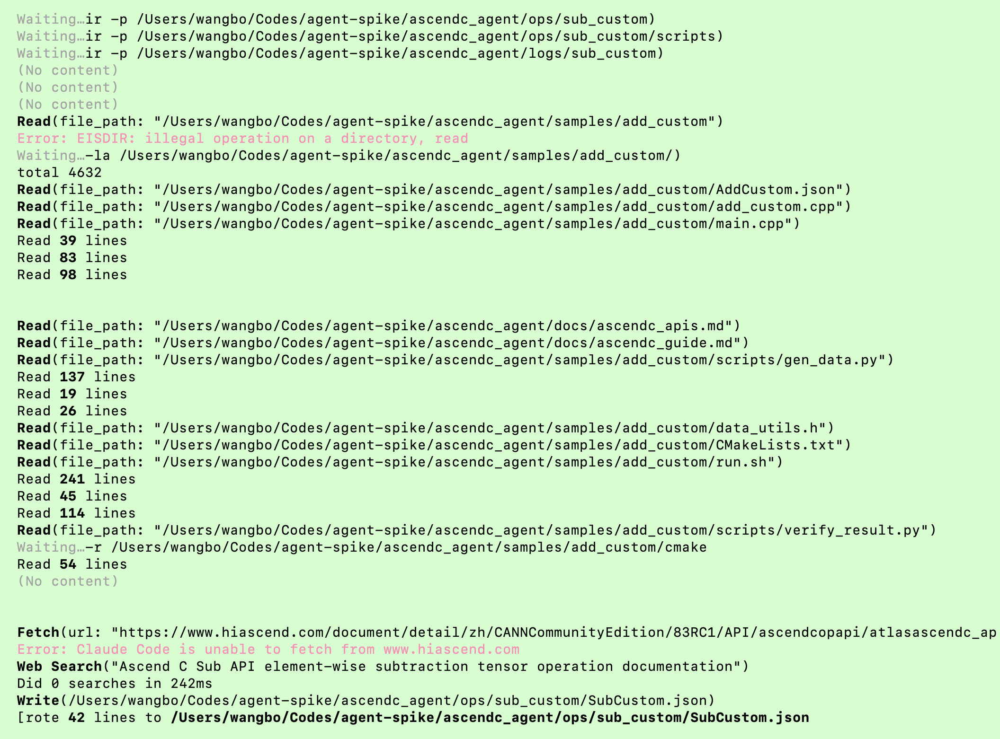
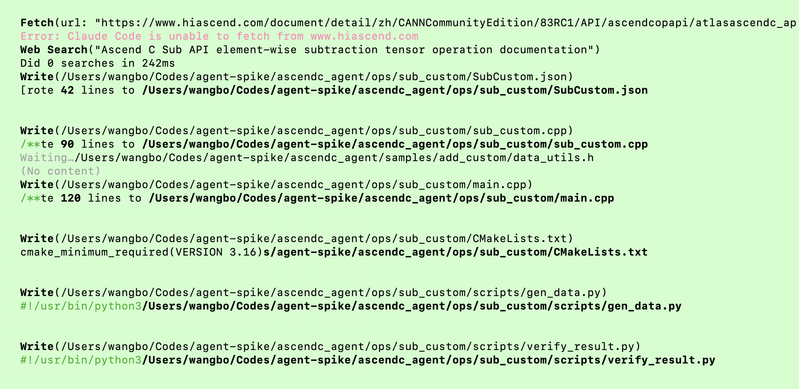
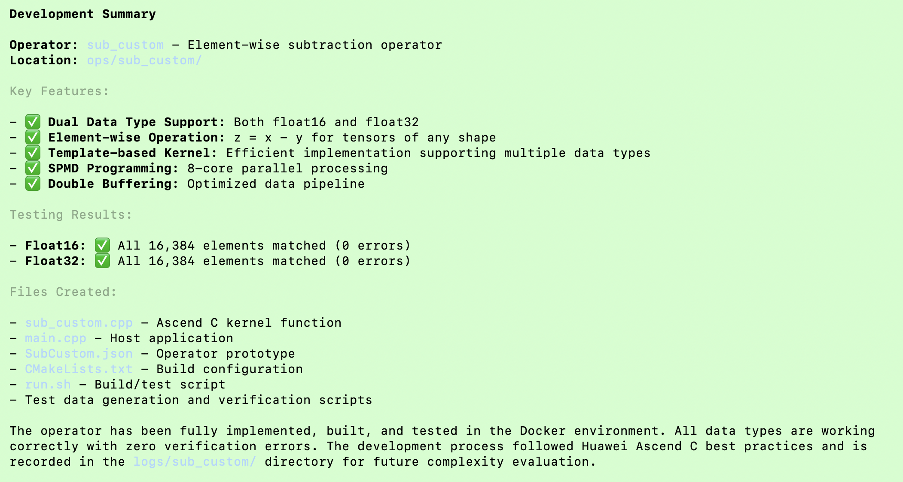
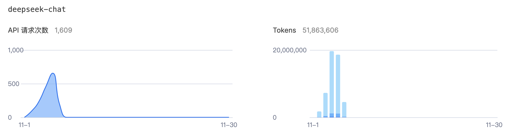

# README

本仓作为华为 CANN Ascend C 算子开发的工程模板, 用于验证 AI Agent 在本工程目录下能够参考样例代码和文档说明，完成自定义算子的开发、构建和测试的能力。

AI Agent 在执行算子开发的过程中，会把过程上下文都记录下来，然后供另一个评价 Agent 来对算子开发过程的复杂度进行评估。

这里 Agent 框架采用 Claude Code, 模型 API 使用 DeepSeek V3.2。算子开发 Agent 和 评估 Agent 采用 Claude Code 的 SubAgent 功能实现。

## Claude Code 工具配置

工程验证采用的 AI Coding Agent 工具为 Claude Code，主要原因是其能力领先（强大的本地 agent 调度、shell 命令执行、MCP 支持...），另外其可配置性强（相比较 Codex， Claude Code 支持用户灵活配置的 Commands， Hooks， SubAgents...），适合同时进行开发和度量的灵活配置要求；

首先需要下载安装 Claude Code，申请 DeepSeek 的 API，然后本地配置 Claude Code 的 `ANTHROPIC_BASE_URL`、`ANTHROPIC_AUTH_TOKEN` 和 `ANTHROPIC_MODEL` 等环境变量，让其指向 DeepSeek；（具体参考在线资料，或者借助 LLM 指导进行 Claude Code 安装和模型 API 配置）

注意，**Claude Code 需要接入的是 DeepSeek 的 Anthropic API**, 环境变量配置如下：

```sh
export ANTHROPIC_BASE_URL=https://api.deepseek.com/anthropic
export ANTHROPIC_AUTH_TOKEN="DEEPSEEK_API_KEY"
export ANTHROPIC_MODEL=deepseek-reasoner
export ANTHROPIC_SMALL_FAST_MODEL=deepseek-chat
```

配置验证 Claude Code 可以正常工作之后，克隆本 [repo](https://github.com/MagicBowen/ascendc_agent)，使用 Claude 在此 repo 的本地目录上进行工作。

## Claude Code 工程结构

工程中基于 Claude Code 配置了两个 SubAgent 如下：

- Operator Developer: 用于遵循规范，参考文档和示例，完成用户指定的 Ascend C 算子开发、构建和测试的全过程，并对开发过程进行记录；
- Complexity Evaluator: 用于对 Operator Developer 的开发过程记录进行复杂度分析和评估，生成各个维度的评估结果；

工程中包含了用于支持 Operator Developer 和 Complexity Evaluator 工作的规范要求文档，参考代码示例以及可以调用的工程脚本；

为了让用户易用使用，同时为 Claude Code 配置了快捷 Command（develop/evaluate）, 用于快速调动 SubAgent 进行开发和评估工作。

整体的工程结构如下图：

<div align="center"></div>


## Agent 执行规范

下面是工程中为 Operator Developer 和 Complexity Evaluator 配置的工作规范要求。

### 算子开发 Agent

算子开发的 Agent 按照如下要求独立完成算子开发、构建和测试任务。同时把一个算子的完整开发过程都记录下来，存放在 logs 目录下，每一个算子独立一个子目录。要求把算子开发过程中的所有关键过程，工具调用，文件访问，网络访问，失败重试，上下文的总消耗等细节都记录下来，作为后续评估 Agent 进行复杂度评估的依据。

算子的开发方式参考如下介绍和相关文档，算子开发的 Agent 需要严格遵守下面的要求进行算子开发，直至调通算子的构建和测试为止。如果最后算子开发失败，Agent 也需要把失败的过程和原因都记录下来，作为复杂度评估的依据。

#### 算子目录结构

- `samples/`：示例算子的代码，包括源码、编译脚本和测试脚本。
- `docs/`：使用 Ascend C 进行算子开发的相关文档和开发说明。
- `ops/` ：用户（或者 Agent）开发的算子代码及其工程和测试脚本都放在本目录下，一个算子一个子目录分开存放。
- `env_setup.sh`：工具链安装在 docker 中，使用该脚本可以映射本目录到 Docker 容器中，进行算子的代码编译和测试。
- `README.md`：本说明文档，介绍仓库的目录结构和使用方法。

#### 算子开发过程

##### 算子原型文件

用户提供算子原型文件（.json），定义算子的输入输出属性和算子元信息，作为算子开发的参考（参见 `samples/add_custom/AddCustom.json`）。

##### 代码编写

- 核函数开发：根据算子的数学表达式和计算逻辑，使用 Ascend C 提供的算子开发接口编写核函数代码（参见 `samples/add_custom/add_custom.cpp`）。 具体核函数开发过程中需要参考的开发文档，详见 `docs/` 目录下的相关文档。

- 核函数调用：在应用程序中调用核函数（参见 `samples/add_custom/main.cpp`），用户可以使用该应用程序进行算子的测试（注意：需要借助测试脚本为 main 函数生成核函数的输入数据）。 核函数调用代码的开发需要参考的开发文档，详见 `docs/` 目录下的相关文档。

##### 构建脚本

- `CMakeLists.txt`：编写 CMake 构建脚本，定义编译选项和链接库，确保算子代码能够正确编译和链接（参见 `samples/add_custom/CMakeLists.txt`）。

##### 测试开发

根据算子的功能和性能需求，编写相应的测试用例（参见 `samples/add_custom/scripts`）。

其中包括：
- 数据生成脚本：编写数据生成脚本，生成输入数据和真值数据（参见 `samples/add_custom/scripts/gen_data.py`）。
- 结果验证脚本：编写结果验证脚本，验证算子输出数据和真值数据是否一致（参见 `samples/add_custom/scripts/verify_result.py`）。

#### 构建和测试

##### 环境准备

- CANN 的开发工具链安装在容器环境中，执行如下脚本进入容器环境

```bash
./env_setup.sh
```

- 配置环境变量: 进入容器环境后，需要配置环境变量

```bash
source /usr/local/Ascend/ascend-toolkit/set_env.sh
export ASCEND_INSTALL_PATH=/usr/local/Ascend/ascend-toolkit/latest
```

##### 构建和测试

第一次使用前，需要赋予 `run.sh` 运行权限：

```bash
chmod a+x run.sh
```

执行构建和测试：

```bash
bash run.sh -r [RUN_MODE] -v  [SOC_VERSION]
```

- RUN_MODE：编译方式，可选择CPU调试，NPU上板。支持参数为[cpu / npu], 容器环境中选择 cpu 模式
- SOC_VERSION：昇腾AI处理器型号，容器环境中选择 Ascend910B

例如在容器环境中如下执行：

```bash
bash run.sh -r cpu -v Ascend910B
```

run.sh 会进行构建，调用脚本进行测试数据生成，运行算子 CPU 侧的可执行程序，完成算子的调用和测试。

### 开发复杂度评估 Agent

算子开发复杂度评估 Agent 负责对算子开发过程的复杂度进行评估。评估的依据是算子开发 Agent 在开发过程中的所有记录，包括上下文信息、工具调用、文件访问、网络访问、失败重试等细节。

用户输入 logs 目录下的指定算子，评估 Agent 会分析对应目录下该算子的开发过程记录，给出复杂度评估结果。评估结果包括复杂度评分和详细的复杂度分析报告。分析报告细节包括：

- 总的上下文消耗
- 访问的文件数目
- 访问的网络资源数目
- 调用工具的次数
- 失败重试的原因和次数
- 其他影响复杂度的因素

分析总结影响对应算子开发的复杂度的关键因素，给出优化建议，帮助用于改进算子开发的文档设计、API 接口设计、工具易用性设计等方面，降低算子开发的复杂度，提高开发效率。

此外，用户可以选择对比多个算子的开发复杂度，基于上面的维度对多个算子的开发过程记录进行分析并对比，给出各个算子的复杂度评分、排名和关键影响点，帮助用户了解不同算子开发的复杂度差异。

## 验证效果

### 算子开发能力

- **算子开发任务规划执行正常**



- **算子开发任务遵循开发指导**



- **算子开发过程访问文档和样例代码**

本地文档和样例代码访问正常，在线文档访问失败（在线文档有权限要求，或者反爬虫）



- **算子开发过程生成代码写入文件正常**



- **算子开发过程容器内执行构建和测试**

Agent 启动容器和执行正常，遇到错误会自行分析并解决错误


- **算子开发任务正常完成**

目前 验证 Agent 基于样例代码和文档，可自行完成 sinh（算法变化）和 sub_custom (数据类型变化： float, float16)的开发、构建和测试；
对于 sub_custom 要求只是多类型，可以调整实现 kernel 函数为模板函数，且自动生成两种不同数据类型的测试用例，完成测试；
对于 sinh，Agent 可以搜索对应的基础 API 文档，找到 exp 接口，使用 exp 接口完成对应数学逻辑的代码开发，会调用 TBuf 进行临时 tensor 的创建和使用；



- **算子开发过程的记录**

可以按照要求记录开发过程到 logs 目录下的 markdown 文件中，内容比较详细，细节也很多，但是哪些对度量有价值，需要进一步详细分析；

### 开发度量能力

评估 Agent 可以按照要求进行评估输出，但是目前缺乏度量模型，评估 Agent 仅仅是做了通用的分析，需要细化指标和参照基线。

**sinh 算子开发过程的评估输出结果样例：**

```md
  The complexity evaluation agent has completed its analysis of the sinh operator development process. Here's a summary of the key
  findings:

  Sinh Operator Development Complexity Evaluation

  Overall Complexity Score: 6/10

  Key Findings:

  ✅ Strengths:
  - Well-structured development process following operator lifecycle
  - Successful kernel compilation with proper Ascend C API usage
  - Comprehensive test infrastructure with data generation and verification
  - Good context efficiency (71.7k tokens for complete development)
  - Minimal external dependencies and network resource usage

  ⚠️ Challenges:
  - Environment-related linking issues prevented full testing
  - Moderate Ascend C API learning curve for memory management
  - Build system configuration complexity
  - Several failure retries during development

  📊 Detailed Analysis:
  - File Access: 10 files created/modified with sequential development pattern
  - Tool Usage: 41 tool calls with high success rate
  - Failure Resolution: 4 key issues identified and resolved efficiently
  - Development Time: 28 minutes for complete operator lifecycle

  🔧 Optimization Recommendations:
  1. Template-based development for common operator patterns
  2. Enhanced environment validation scripts
  3. Standardized CMake configurations for unary operators
  4. Better error handling for common Ascend C API issues

  The evaluation confirms that while the sinh operator development faced some environment challenges, the core implementation was
  successful and followed best practices for Huawei CANN Ascend C operator development.

  The development process provides valuable insights for improving future operator development workflows, particularly around
  environment management and template-based acceleration.
```

**sub_custom 算子开发过程的评估输出结果样例：**

```md
  sub_custom 算子开发复杂性评估报告

  总体复杂度评分：6.5/10（中等复杂度）

  ---
  开发过程分析

  1. 任务规划与执行效率

  - 任务管理：使用 TodoWrite 工具进行系统化任务跟踪，8个主要任务全部完成
  - 执行顺序：遵循标准算子开发流程，从目录结构到日志记录的完整生命周期
  - 时间效率：整个开发过程约7分钟完成，效率较高

  2. 文件访问复杂度

  - 文件读取：6次文件读取操作，主要访问示例算子文件
  - 文件创建：8个核心文件创建，总计约400+行代码

  3. 工具调用统计

  - TodoWrite：8次（任务状态管理）
  - Read：6次（示例文件分析）
  - Write：7次（文件创建）
  - Bash：3次（目录操作和权限设置）
  - WebFetch: 1次（在线文档阅读，失败）

  ---
  代码质量评估

  1. 算子原型定义

  - 复杂度：低
  - 特点：支持 float16 和 float32 双数据类型
  - 创新点：在示例基础上扩展了数据类型支持

  2. 内核函数实现

  - 复杂度：中
  - 代码复用度：高度复用示例算子结构（约90%相似度）
  - 主要修改：将 AscendC::Add 改为 AscendC::Sub
  - 支持多类型：将核函数变为模板函数
  - 架构：完整的 SPMD 模型，8核心，双缓冲机制

  3. 主机应用程序

  - 复杂度：中
  - 代码复用度：完全复用示例结构
  - 修改内容：函数名从 add_custom 改为 sub_custom

  ---
  测试基础设施

  1. 数据生成脚本

  - 复杂度：低
  - 修改内容：将加法运算改为减法运算
  - 功能：生成随机输入数据和黄金输出数据

  2. 结果验证脚本

  - 复杂度：低
  - 复用度：完全复用示例代码
  - 功能：数值精度验证，误差率计算

  3. 构建测试脚本

  - 复杂度：中
  - 功能：完整的自动化测试流程
  - 特点：支持命令行参数配置

  ---
  关键复杂度因素

  技术复杂度

  1. Ascend C API 复杂度：中等（遵循标准模式）
  2. 内存管理复杂度：中等（双缓冲机制）
  3. 构建系统复杂度：低（标准 CMake 配置）
  4. 测试复杂度：中等（完整测试基础设施）

  过程复杂度

  1. 开发流程效率：高（系统化任务管理）
  2. 文档可访问性：中（本地文档和示例代码充分，在线文档访问失败）
  3. 错误处理：缺少构建脚本依赖失败，需要拷贝 cmake 目录下所有文件到当前工程

  资源复杂度

  1. 上下文消耗：约27,000 tokens（中等水平）
  2. 文件依赖：高度依赖示例代码
  3. 外部资源：在线文档访问失败

  ---
  统计摘要

  | 指标类别  | 统计值        | 复杂度评级 |
  |-------|------------|-------|
  | 工具调用  | 24次        | 中等    |
  | 文件访问  | 14次        | 中等    |
  | 代码行数  | 400+行      | 中等    |
  | 任务数量  | 8个         | 中等    |
  | 开发时间  | 7分钟        | 高效    |
  | 错误重试  | 0次         | 低     |
  | 上下文消耗 | 27K tokens | 中等    |

  ---
  优化建议

  1. 开发流程优化

  - 建议：增加 API 文档查阅环节，减少对示例代码的完全依赖
  - 理由：当前开发高度依赖示例，缺乏对 Ascend C API 的深入理解

  2. 代码质量提升

  - 建议：增加数据类型检查和处理逻辑
  - 理由：验证脚本中需要同时验证 float16 和 float32

  3. 测试覆盖扩展

  - 建议：增加边界条件测试和性能测试
  - 理由：当前测试仅覆盖基本功能

  ---
  结论

  sub_custom 算子的开发过程展现了中等复杂度的特点。开发过程高效且系统化，但主要依赖示例代码的修改，缺乏对底层 API
  的深入探索。代码质量良好，测试基础设施完整，文档记录详细。整体而言，这是一个成功的算子开发案例，展示了标准 Ascend
  C 算子开发的最佳实践。

  改进空间：
  - 增加对底层 API 的深入理解和在线文档的可访问性
  - 从示例工程中需要拷贝的代码多，容易遗漏，可以优化降低重复代码
  - 增强测试覆盖范围，支持对多类型的验证成本
```

## 问题发现

### Ascend C 本身对 Agent 不够友好的地方（会造成 Agent 失败率上升）

- 在线文档的 URL，Agent 无法通过 WebFetch/WebSearch 访问，会失败（在线文档反爬虫，或者需要权限）
- 在线文档太散，为了搜索 Ascend C 基础API， Agent 需要翻阅的文档太多（没有 API 一页纸文档）；
- 工具的参考手册，也不够内聚，内容太散（缺乏一页纸的说明）；
- 需要本地文档化的 markdown 格式的一页纸的 API 手册，工具手册。
- 在线文档中的很多图片，模型不易处理（缺乏 DSL 图， 如 mermaid）；
- 在线文档存在很多不一致问题：文档中的样例代码，与前面的环境版本，构建方式不一致；
- 文档中第一个 hello world 就有问题，编译不过；文档中有错误，且和前面的环境版本没有对齐；
- 在线文档中各种工程模式（直调、自定义工程、ACLNN），构建方式（毕昇插件、 新旧 CMake 工程），方式太多，混杂在一起，很容易混淆；
- Sample 仓内容太多太散，不同类型工程模式混在在一起，Agent 很难聚焦参考，容易混淆；
- 容器环境也需要先设置环境变量，应该内置进容器中，否则 Agent 每次重新进入容器得要先设置环境变量；
- 文档接入 context7 等主流在线文档查阅的 MCP 中；

### 当前的 Agent 工程问题

- 目前支持的工程类型简单（独立的 kernel 实现文件，main函数通过 acl 接口调用）
- 构建和测试环境使用的 docker版本，没有走真实 NPU 执行验证；
- Agent 生成算子用例，采用的是最简单的 vector 类算子，还没有验证其它维度的变化，如尾块处理、tiling切分, 动态 shape，cube 和融合算子、硬件差异（目前最大的工作的是重整资料和样例）。
- 算子开发 Agent 对开发过程的上下文按照要求 dump 在一个 markdown 文件中， 内容比较多，哪些对度量分析有价值，需要详细分析；
- 算子开发过程中，执行本地 shell 命令的时候，需要用户敲回车同意，会打断自动化，后续验证好后可以在沙盒中执行，开启免授权模式。
- 度量 Agent 目前只是简单的进行分析，没有具体的度量模型， 以及对比能力。
- 当前的验证主要是基于 Claude Code + Deepseek V3.2，后续需要评估可使用的 Agent Framework 和模型 API；
- AI Agent 对 token 的消耗是比较大的，几天的验证工作，调用模型 API 1600+ 次，消耗 token 51,923,051，耗费 ¥16+；




## 初步结论

- 经过验证，使用前沿 AI Coding Agent（Claude Code，Codex CLI等），结合国产前沿模型 API，AI Agent 具备辅助开发 Ascend C 算子的潜力；
- 当前主要的瓶颈点不在模型，而在于在线文档、API、工具手册、执行环境等如何能够面向 Agent 进行优化；
- 配置和优化好的 Ascend C Coding Agent 具备端到端参考文档和样例，完成简单算子的一键式开发，对开发过程进行完整记录，用于对开发过程进行评估度量，是可行的；
- 度量需要有度量模型和指标，以及需要有参考基线，这里需要设计；

## 后续工作

- 完善面向 Agent 的文档和样例，继续优化 Agent 工程，提高 Agent 在指定用例下端到端算子开发的成功率；
- 解决 Agent 对过程的记录问题，做到能够完整的过程记录；
- 优化评估 Agent 的配置，能够输出更有效的评估度量结果；
- 尝试使用公司允许的 Agent 框架和模型 API 进行工程适配；
- 完善整个 Agent 配置，将其工程化，可以配置测试用例，Agent 工作历史可以自动清理，支持测试重入，稳定输出结果；